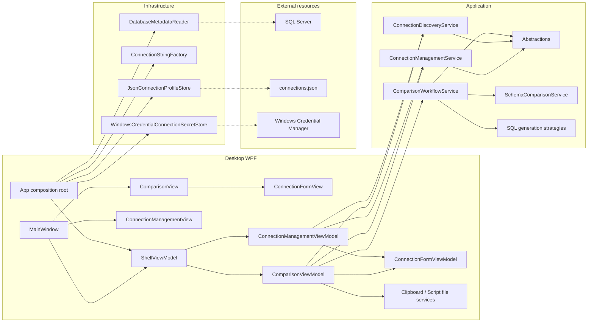
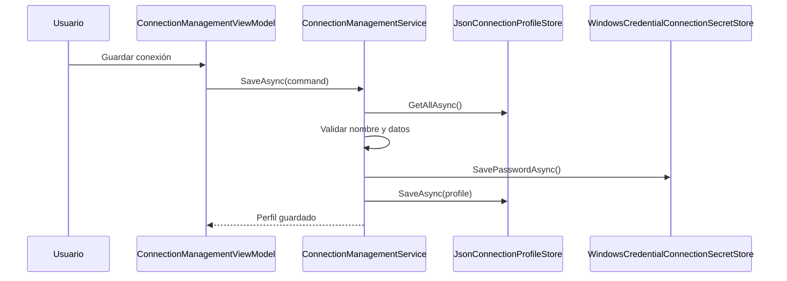
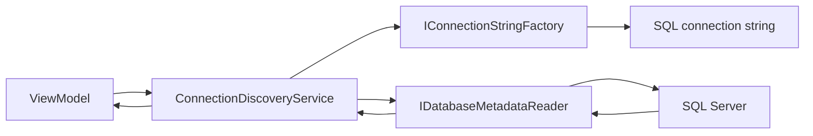
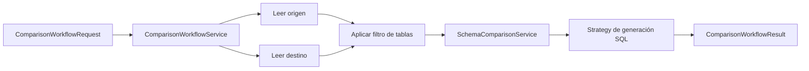
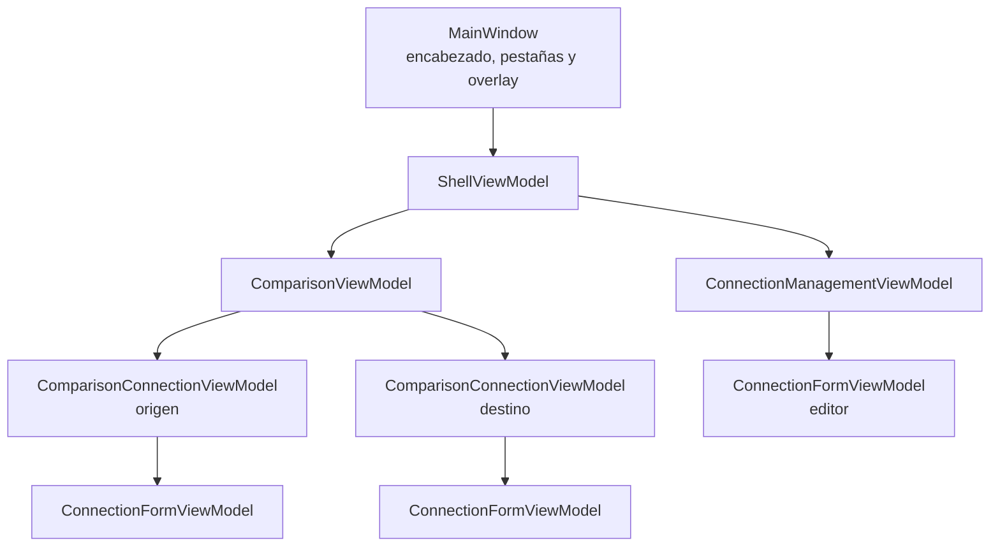

# Arquitectura del Comparador de Bases de Datos

## Propósito

La aplicación es un cliente WPF que compara la estructura de dos bases SQL Server y genera un script SQL. La interfaz no ejecuta cambios en ninguna base de datos.

La solución sigue una separación por capas: `Desktop` presenta el estado y recibe acciones del usuario; `Application` contiene los casos de uso y contratos; `Infrastructure` implementa acceso a SQL Server, almacenamiento local y credenciales; `Domain` conserva las definiciones estructurales comparables.



## Regla de dependencias

```text
Desktop ──────────────► Application ◄────────────── Infrastructure
   │                         │                            │
   └─ Solo en App.xaml.cs ───┴── construye implementaciones ┘

Application ──────────► Domain
Infrastructure ───────► Application + Domain
Domain ───────────────► ninguna otra capa
```

`Desktop` puede referenciar `Infrastructure` únicamente en `App.xaml.cs`, que es el punto de composición. Los ViewModels no deben instanciar ni importar implementaciones de infraestructura.

## Responsabilidades por proyecto

| Proyecto | Responsabilidad | No debe contener |
|---|---|---|
| `Domain` | `TableDefinition`, `ColumnDefinition` y reglas estructurales puras. | WPF, SQL Server, archivos o credenciales. |
| `Application` | Casos de uso, modelos de entrada/salida, contratos y generación de scripts. | Controles WPF, rutas locales, P/Invoke o SQL concreto. |
| `Infrastructure` | SQL Server, JSON local y Windows Credential Manager. | Reglas de comparación ni estado visual. |
| `Desktop` | XAML, ViewModels, comandos, mensajes y estado de la pantalla. | Reglas de negocio y acceso directo a almacenamiento o SQL Server. |

## Casos de uso actuales

### Gestión de conexiones

`ConnectionManagementService` coordina la persistencia de un perfil y su contraseña.



Los metadatos no sensibles se guardan en `%LocalAppData%\Comparador\connections.json`. La contraseña se almacena separadamente en el Administrador de credenciales de Windows y sólo se recupera para conectarse.

### Descubrimiento de conexión

`ConnectionDiscoveryService` recibe credenciales temporales, delega la cadena de conexión a `IConnectionStringFactory` y solicita metadatos mediante `IDatabaseMetadataReader`.



Al seleccionar un perfil guardado en la pestaña **Comparar**, el ViewModel solicita este caso de uso para cargar automáticamente las bases disponibles y el esquema inicial.

### Comparación y generación de script

`ComparisonWorkflowService` concentra el flujo completo, sin que el cliente consulte SQL Server directamente.



El resultado incluye las diferencias, el script, los avisos, la cantidad de instrucciones generadas y las tablas excluidas por filtro.

## Punto de composición

`Desktop/App.xaml.cs` es el único lugar donde se crean implementaciones concretas y se conectan con interfaces:

```text
JsonConnectionProfileStore                 -> IConnectionProfileStore
WindowsCredentialConnectionSecretStore     -> IConnectionSecretStore
DatabaseMetadataReader                     -> IDatabaseMetadataReader
ConnectionStringFactory                    -> IConnectionStringFactory
```

Después, `App` crea los servicios de Application, los adaptadores propios de WPF y el `ShellViewModel`. El shell comparte la colección de perfiles entre `ComparisonViewModel` y `ConnectionManagementViewModel`. Esto permite reemplazar infraestructura en el futuro —por ejemplo, un almacén centralizado o un lector para otro motor— sin modificar la interfaz.

## Arquitectura de presentación



`MainWindow.xaml.cs` sólo inicializa la vista y asigna el `DataContext`. La sincronización de `PasswordBox` y la selección de bases se implementan mediante `PasswordBoxBehavior` y `ComboBoxSelectionBehavior`, por lo que no existen eventos funcionales en el code-behind.

Las vistas se distribuyen así:

| Vista | Responsabilidad |
|---|---|
| `MainWindow` | Shell visual, pestañas, encabezado y overlay de comparación. |
| `ComparisonView` | Configuración, comparación, script y acciones del resultado. |
| `ConnectionFormView` | Formulario reutilizable de origen y destino. |
| `ConnectionManagementView` | Listado y edición de perfiles guardados. |

Los recursos compartidos viven en `Themes/Colors.xaml` y `Themes/Controls.xaml`. El acceso al portapapeles y al diálogo para guardar scripts queda detrás de interfaces de `Desktop/Services`, evitando dependencias WPF dentro de los ViewModels.

## Convenciones para cambios futuros

- Una regla de negocio o validación debe vivir en `Application` o `Domain`, nunca en un ViewModel.
- Un acceso a archivos, Credential Manager, P/Invoke o `SqlConnection` debe vivir en `Infrastructure`.
- Un ViewModel puede transformar estado de pantalla en un comando de Application y transformar el resultado en mensajes o colecciones visuales.
- Las interfaces se definen en `Application`; las implementaciones se registran en el punto de composición.
- Las contraseñas no se incluyen en archivos, registros ni mensajes de error.

## Trabajo técnico pendiente

- La composición actual es manual y explícita. Si el número de servicios crece, se puede sustituir por un contenedor de inyección de dependencias.
- Aún no hay pruebas automatizadas por decisión del proyecto. Cuando se incorporen, los servicios de Application podrán probarse con implementaciones falsas de sus interfaces.
